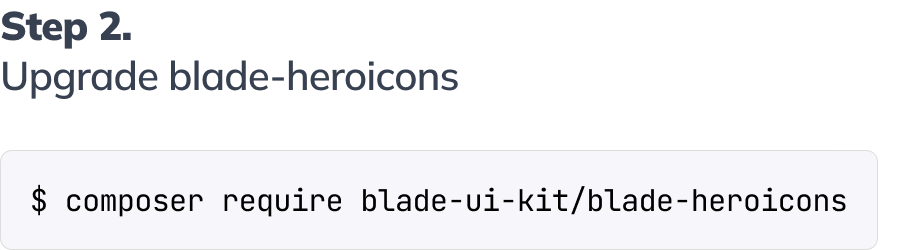
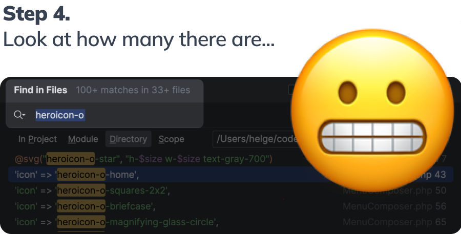
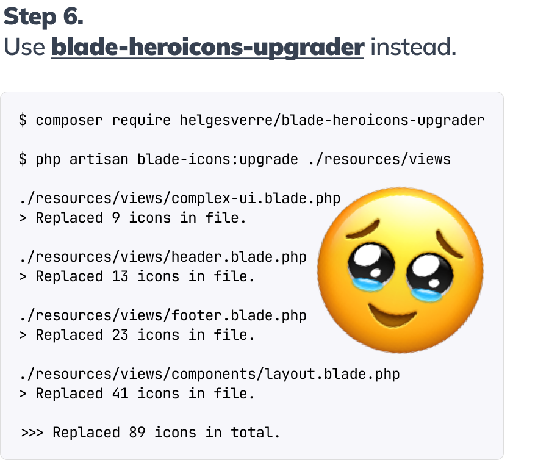

<p align="center"></p>

# Blade Heroicons Upgrader

[](https://packagist.org/packages/helgesverre/blade-heroicons-upgrader)

## Storytime.

<div style="background:#fefefe;margin-bottom:20px;padding: 20px;"></div>
<div style="background:#fefefe;margin-bottom:20px;padding: 20px;"></div>
<div style="background:#fefefe;margin-bottom:20px;padding: 20px;"></div>
<div style="background:#fefefe;margin-bottom:20px;padding: 20px;"></div>
<div style="background:#fefefe;margin-bottom:20px;padding: 20px;"></div>
<div style="background:#fefefe;margin-bottom:20px;padding: 20px;"></div>


## What it does.

> This only supports [Blade Heroicons](https://github.com/blade-ui-kit/blade-heroicons).

🔧 Blade Heroicons Upgrader is a Laravel tool specifically designed for updating from Heroicons v1 to v2 in Blade files.
It simplifies the process of transitioning to the latest Blade Heroicons version, making it quick and effortless.

This tool replaces old icon names in your code, such as `@svg("clipboard-check")` and `<x-clipboard-check />`, and
updates them to their new v2 equivalents such as `@svg("clipboard-document-check")`
and `<x-clipboard-document-check />`.

It's built to prevent overlapping or incorrect updates, ensuring that icons are not mistakenly transformed into formats
like `<x-heroicon-o-server-stack-stack />`. It also supports the new `outline` and `solid` variants, so you can easily
update to the new syntax, such as `<x-heroicon-o-server />` and `<x-heroicon-s-server />`.


## Installation

You can install the package via composer:

```bash
composer require --dev helgesverre/blade-heroicons-upgrader
```

## Usage

Run the command to upgrade your blade files:

```bash
php artisan blade-icons:upgrade 
```

You may also specify a directory to search in:

```bash 
php artisan blade-icons:upgrade resources/views
```

You can also do a dry run to see what will be changed:

```bash
php artisan blade-icons:upgrade --dry
```

Adding an FAQ section to your README is a great way to address common questions and concerns. Here's how you can
incorporate the FAQ with the questions and answers you provided:

## FAQ

**Q: Does it work for other icon sets?**  
A: No, maybe in the future

**Q: My icon was replaced with the wrong one. What should I do?**  
A: If you encounter any incorrect replacements, Please submit a pull
request with the correction. Your help in would be greatly appreciated!

**Q: Why did you build this?**  
A: I had to do this process manually 4 times this year, and was tired of doing it.

## License

The MIT License (MIT). Please see [License File](LICENSE.md) for more information.
